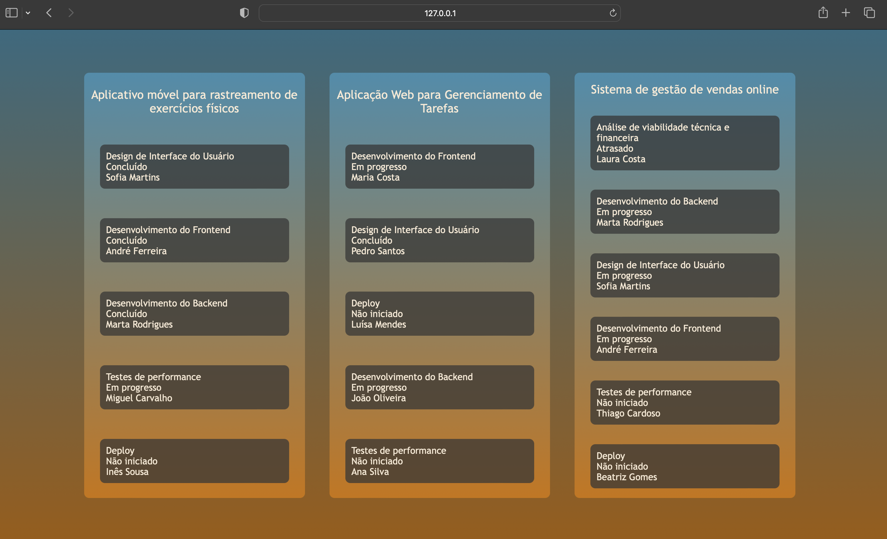

# Boas vindas ao repositório do Project Manager

Esse é um gerenciador de projects nos quais uma empresa está trabalhando.

Para executar este project, é indispensável que você tenha o Python instalado em sua máquina, além disso, é necessário ter o Docker ou o MongoDB instalados.

Após clonar o repositório e acessar o diretório do project pelo terminal, siga os seguintes passos:

## Preparando Ambiente

🳠Subindo a aplicação com Docker

**[1]** Suba os containers
> `docker-compose up -d`

**[2]** Popule o banco
> `docker exec -it mongo_db bash`
> `cd ./seeders`
> `mongoimport --jsonArray --db db_project --collection projects --file project.json`
> `exit`

Por padrão aplicação estará rodando na porta `8000`, você pode acessá-la pelo navegador na rota <http://127.0.0.1:8000/>.

Quando estiver tudo certo, sua aplicação deve se parecer com essa:

