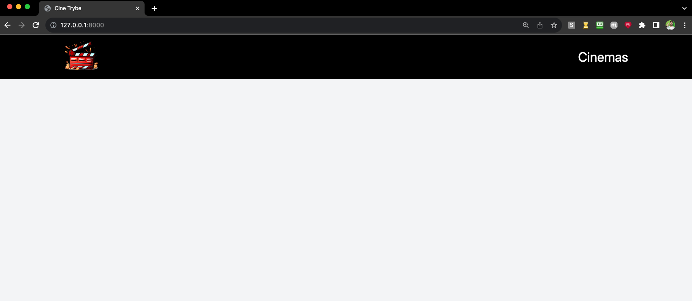

# Cine Trybe - Aplicação Django

## Execução da aplicação
---

1. Clone o repositório da aplicação

```bash
git clone git@github.com:tryber/python-conteudo-django-cinetrybe.git
```

2. Faça o build da imagem do docker

```bash
docker build -t cinetrybe-db .
```

3. Execute o container

```bash
docker run -d -p 3306:3306 --name=cinetrybe-mysql-container -e MYSQL_ROOT_PASSWORD=password -e MYSQL_DATABASE=cinetrybe_database cinetrybe-db
```

4. Crie o ambiente virtual e o ative

```bash
python3 -m venv .venv && source .venv/bin/activate
```

5. Instale as dependências do projeto

```bash
python3 -m pip install -r requirements.txt
```

6. Execute o comando para criar as migrações e aplicá-las:

```bash
python3 manage.py makemigrations && python3 manage.py migrate
```

7. Execute o servidor para ver a aplicação em funcionamento:

```bash
python3 manage.py runserver
```



## Adicionando novos registros ao banco de dados

### Método 1: Usando o painel admin

1. Execute o comando para criar as credenciais de acesso ao painel admin:

```bash
python3 manage.py createsuperuser
```

2. Siga o passo a passo no terminal, informando login, email e senha.
   
3. Acesse o painel admin em [http://localhost:8000/admin](http://localhost:8000/admin) e faça login com as credenciais criadas.

4. Navegue pelos modelos e adicione novos registros preenchendo os formulários.

